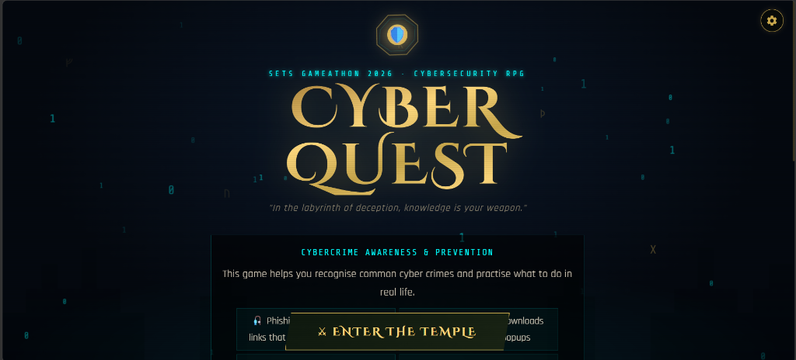
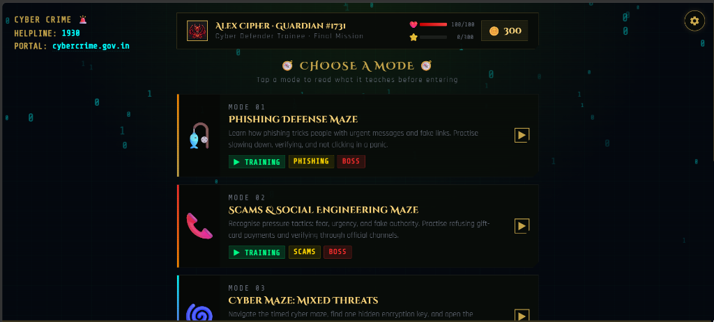
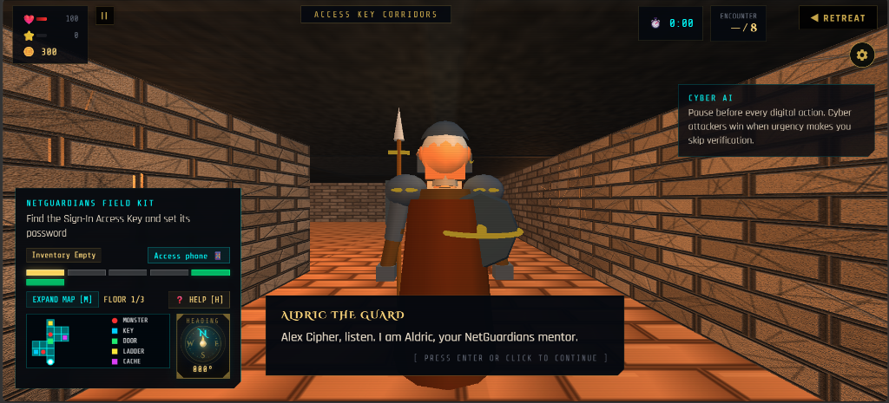
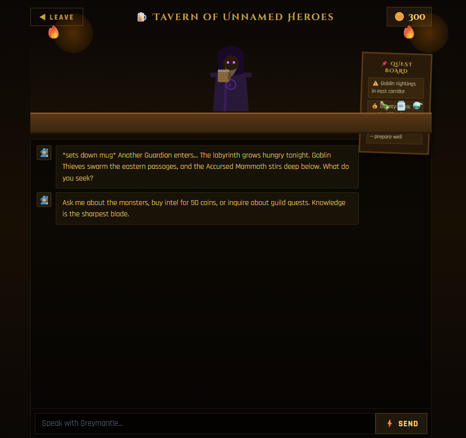
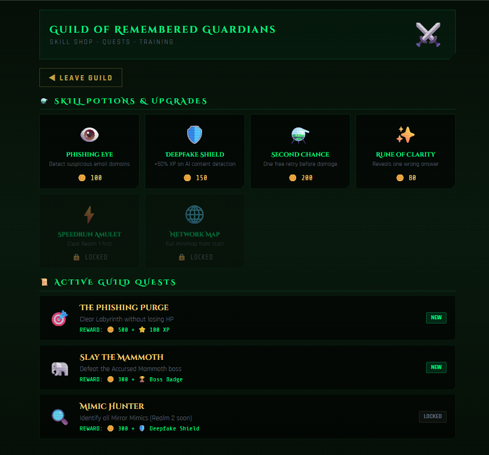
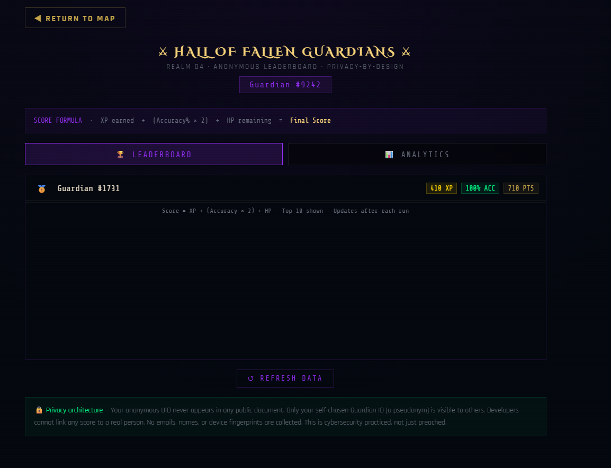

# ⚔ CyberQuest RPG

> *A cybersecurity awareness game where you battle cyber threats as a Guardian of the Digital Realm*

[](https://cyberquest-rpg.web.app)
[](https://www.setsindia.net)
[](LICENSE)

---

## 🎮 About

CyberQuest RPG is a browser-based role-playing game that teaches real-world cybersecurity awareness through immersive gameplay. Players battle monsters that each represent a distinct cyber threat — from phishing and deepfakes to malware and brute-force attacks — answering knowledge challenges to defeat them.

Built as a **single self-contained HTML file** with zero dependencies beyond CDN-loaded libraries. No installation, no build step — just open and play.

**Submitted to:** [SETS Gameathon 2026](https://www.setsindia.net) — Society for Electronic Transactions and Security, Chennai  
**Team:** Internet Rangers  
**Institution:** C.R. Rao Advanced Institute of Mathematics, Statistics and Computer Science (AIMSCS), Hyderabad

---

## 🌐 Play Now

**[https://cyberquest-rpg.web.app](https://cyberquest-rpg.web.app)**

No login. No install. Works in any modern browser.

---

## 📸 Screenshots

**Title Screen**


**The Four Realms — Hub**


**3D World — Aldric's Post**


**Tavern of Unnamed Heroes — AI Bartender**


**Guild of Remembered Guardians — Skill Shop**


**Hall of Fallen Guardians — Leaderboard**


---

## 🗺 The Four Realms

| Realm | Name | Description |
|-------|------|-------------|
| 01 | **Labyrinth of the Lost** | First-person corridor dungeon. 5 monsters + 1 boss. Multiple-choice cybersecurity challenges |
| 02 | **Tavern of Unnamed Heroes** | AI bartender powered by Claude (Anthropic). Ask anything about cyber threats |
| 03 | **Guild of Remembered Guardians** | Coin-based skill shop and quest board |
| 04 | **Hall of Fallen Guardians** | Anonymous real-time leaderboard with privacy-by-design architecture |

---

## 👾 Cyber Threat Roster

| Monster | Threat | Realm |
|---------|--------|-------|
| Goblin Thief *Phishfang* | Phishing & typosquatting | Labyrinth + 3D World |
| Mirror Mimic *Deepface* | Deepfakes & impersonation | Labyrinth + 3D World |
| Authority Gang | Social engineering | Labyrinth + 3D World |
| Software Phantom | Malware distribution | Labyrinth + 3D World |
| OTP Wraith | SIM swap & OTP fraud | Labyrinth |
| **BOSS** Accursed Mammoth | Brute force attacks | Labyrinth + 3D World |

---

## ⚙ Tech Stack

| Layer | Technology |
|-------|-----------|
| Engine | Vanilla HTML5 / CSS3 / JavaScript — zero frameworks |
| 3D World | [Three.js r128](https://threejs.org) — first-person camera, WASD combat, torch lighting |
| AI Bartender | [Anthropic Claude API](https://anthropic.com) (`claude-sonnet-4-20250514`) |
| Backend | [Firebase](https://firebase.google.com) — Anonymous Auth + Firestore |
| Fonts | Google Fonts (Cinzel Decorative, Rajdhani, Share Tech Mono) |
| Hosting | Firebase Hosting |

**Total size:** ~184 KB · Single file · No build process

---

## 🔒 Privacy Architecture

CyberQuest practices what it preaches:

- **Anonymous Auth only** — no email, name, or password ever collected
- **Guardian IDs** are auto-assigned pseudonyms (e.g. `Guardian #9242`) — chosen by the system, not the player
- **Firestore security rules** ensure each browser can only read/write its own session document
- The `leaderboard` collection exposes only Guardian ID + score — anonymous UIDs are never public
- The `runs` collection stores aggregate analytics with no UID reference whatsoever
- Developers cannot link any score or session to a real person

---

## 🏆 Leaderboard Score Formula

```
Score = XP earned + (Accuracy% × 2) + HP remaining
```

---

## 📁 Repository Structure

```
cyberquest-rpg/
├── index.html          # Entire game — frontend + 3D engine + AI + backend hooks
├── firebase.json       # Firebase Hosting config
├── .firebaserc         # Firebase project alias
├── .gitignore
├── LICENSE
├── README.md
└── docs/               # Screenshots
    ├── title.png
    ├── hub.png
    ├── world3d.png
    ├── tavern.png
    ├── guild.png
    └── leaderboard.png
```

---

## 🚀 Running Locally

Because the game uses Firebase (which requires HTTPS or localhost), **do not open `index.html` by double-clicking**. Instead:

**Option 1 — Firebase CLI (recommended):**
```bash
firebase serve
```
Then open `http://localhost:5000`

**Option 2 — Any local server:**
```bash
# Python
python -m http.server 8000

# Node
npx serve .
```

---

## 👥 Team

| Name | Role |
|------|------|
| Sai Rakesh | Co-developer, Internet Rangers |
| Yashovardhan Reddy Kandi | Co-developer, Internet Rangers |

**Institution:** C.R. Rao AIMSCS, Hyderabad  
**Competition:** SETS Gameathon 2026 — Round 2 Selected

---

## 📄 License

This project is licensed under the [MIT License](LICENSE).  
© 2026 Internet Rangers — C.R. Rao AIMSCS, Hyderabad
