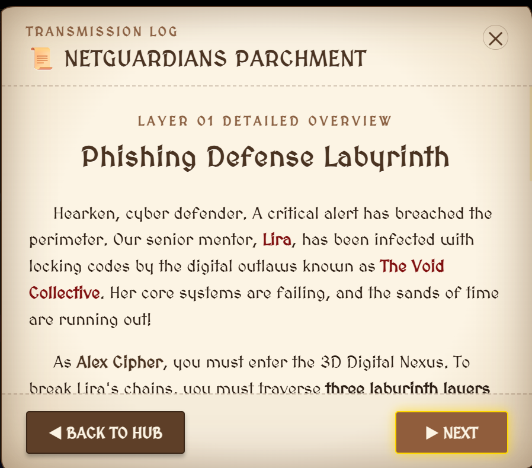
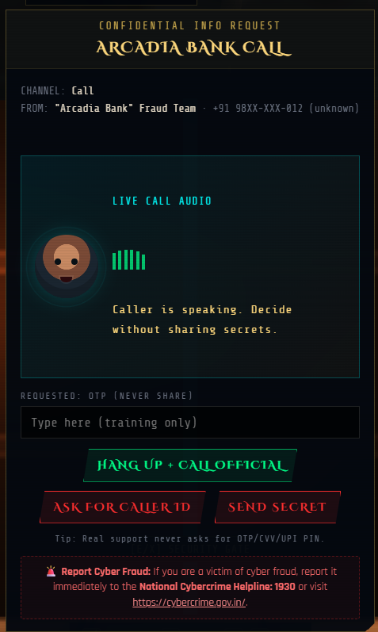
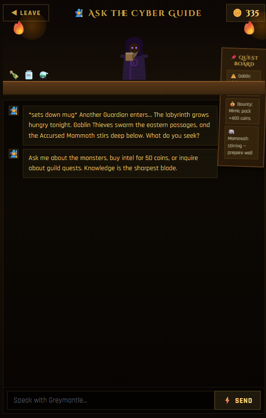

# CyberQuest RPG

CyberQuest RPG is a browser-based cybersecurity awareness game where players become Guardians of the Digital Realm and battle threats inspired by real cybercrime patterns.

Submitted to: SETS Gameathon 2026  
Team: Internet Rangers  
Institution: C.R. Rao Advanced Institute of Mathematics, Statistics and Computer Science (AIMSCS), Hyderabad

## Play

Live demo: https://cyberquest-rpg.web.app

No account or personal profile is required. The game uses anonymous Firebase authentication for progress and leaderboard features.

## What Is Included

CyberQuest is designed as a fast playable prototype for awareness training:

- Title screen with a cybercrime awareness briefing
- Mode selection hub with short learning previews
- Phishing Defense Maze
- Scams and Social Engineering Maze
- Mixed Threats Cyber Maze
- Deepfake and Impersonation Maze
- Malware and Fake Update Maze
- Password and Brute-Force Fortress
- Ask the Cyber Guide, an AI helper served through Firebase Functions
- Defender Toolkit with optional upgrades
- Anonymous leaderboard and aggregate analytics
- Three.js first-person 3D world with WASD combat

## Screenshots










## Cyber Threat Coverage

| Topic | What the game teaches |
| --- | --- |
| Phishing | Slow down, inspect links, avoid fake login traps, never share OTPs |
| Social engineering | Recognise fear, urgency, authority pressure, and payment red flags |
| Deepfakes and impersonation | Verify identity through a trusted second channel |
| Malware | Avoid fake updates, popups, and unofficial downloads |
| Password attacks | Use long passphrases, avoid reuse, enable MFA |
| OTP fraud | Treat OTPs, CVV, UPI PINs, and recovery codes as private secrets |

## Tech Stack

| Layer | Technology |
| --- | --- |
| Game | Vanilla HTML, CSS, and JavaScript |
| 3D world | Three.js r128 |
| Backend | Firebase Anonymous Auth, Firestore, Hosting, Functions |
| AI guide | Groq chat completion API through a server-side Firebase Function |
| Fonts | Google Fonts: Cinzel Decorative, Rajdhani, Share Tech Mono |

Most of the game remains in `index.html` for easy judging and portability. The AI guide is the exception: it now calls `/api/guide`, which is routed to a Firebase Function so API keys are not exposed in the browser.

## Repository Structure

```text
cyberquest-rpg/
|-- index.html              # Main game prototype
|-- firebase.json           # Firebase Hosting + Function rewrite config
|-- .firebaserc             # Firebase project alias
|-- functions/
|   |-- index.js            # Server-side AI guide proxy
|   |-- package.json
|   `-- .env.example
|-- docs/                   # Screenshots
|   |-- title.png
|   |-- hub.png
|   |-- parchment.png
|   |-- world3.png
|   |-- scam_call.png
|   |-- cyber_guide.png
|   `-- leaderboard.png
|-- LICENSE
`-- README.md
```

## Running Locally

Because Firebase Auth works on localhost but not from a random double-clicked file, run the game through a local server.

Static-only smoke test:

```bash
python -m http.server 8000
```

Then open:

```text
http://localhost:8000
```

For the AI guide and Firebase rewrite path, use Firebase emulators:

```bash
cd functions
npm install
cd ..
firebase emulators:start --only hosting,functions
```

## AI Guide Key Setup

Do not put Groq or other AI provider keys in `index.html`.

For deployed Firebase Functions, set the secret:

```bash
firebase functions:secrets:set GROQ_API_KEY
```

Then deploy:

```bash
firebase deploy --only functions,hosting
```

For local emulator testing, copy `functions/.env.example` to `functions/.env` and fill in `GROQ_API_KEY`.

## Privacy Architecture

- Anonymous Auth only: no email, name, or password is collected.
- Guardian IDs are generated pseudonyms such as `Guardian #9242`.
- Leaderboard entries expose only Guardian ID and score data.
- Aggregate run analytics do not require real-world identity.
- The AI guide endpoint receives recent chat messages only; avoid entering personal information.

## Leaderboard Score

```text
Score = XP earned + (Accuracy% x 2) + HP remaining
```

## Team

| Name | Role |
| --- | --- |
| Sai Rakesh | Co-developer, Internet Rangers |
| Yashovardhan Reddy Kandi | Co-developer, Internet Rangers |

## License

This project is licensed under the MIT License.
